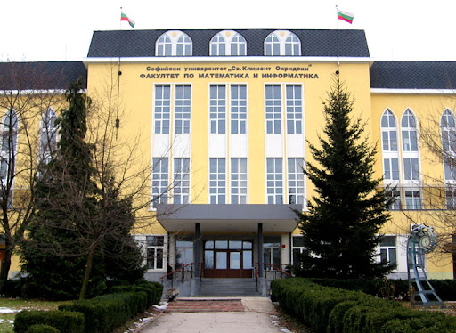

## Задача 1. 

Реализирайте темплейтен клас **Vector** (динамичен масив), който има минимум следните функции:

- push_back(elem) - добавя елемент в края на вектора (да може и да се прави копие на подадения обект, и да се откраднат данните му)
- pop_back() - изтрива последния елемент на вектора
- size() - връща размера на вектора
- isEmpty() - проверява дали векторът има елементи 
- insert(elem, index) - добавя елемент на даден индекс във вектора
- erase() - изтрива елемент на даден индекс във вектора
- clear() - изчиства данните във вектора
- operator[indx] - връща елемент на определен индекс
- find(elem) - връща позицията на елемента 'elem', ако се съдържа във вектора, в противен случай не връща нищо 
***Hint: Използвайте клас Optional***

## Задача 2 - Хетерогенен контейнер
Реализирайте абстрактен клас "SubjectInFMI", който притежава следните атрибути:
- име на предмета
- име на лектор
- списък от имената на асистентите
- точки за преминаване (int)

Следните член-функции трябва да се имплементират от наследниците:
- gradeToPass() 
    - Ако предметът е ДИС - 70% oт точките са нужни за преминаване
    - Ако предметът е ООП - 80%  oт точките са нужни за преминаване
    - Ако предметът е ДСТР2 - 60%  oт точките са нужни за преминаване
    - Ако предметът е УП - 50% от точките са нужни за преминаване
    - Ако предметът е ГЕОМЕТРИЯ - 75% oт точките са нужни за преминаване
- getSubjectName() - отпечатва името на предмета

Предментите във ФМИ са: 
- Диференциално и интегрално смятане (DIS/Calculus): 
- OOП - има допълнителен атрибут - бонус точки, които се включват към финалната оценка
- ДСТР2
- УП
- ГЕОМЕТРИЯ 

Реализирайте подходящ клас, който менажира контейнер от предметите във фми. Той трябва да има:
- член-функция връщаща размера 
- предмета, който се среща най-много пъти в контейнера 

## (Бонус1) Задача 3 - 2т :
Да се реализира абстрактен базов клас Item, който описва елемент на екрана на мобилно устройство. Всеки такъв елемент има заглавие - символен низ. Това заглавие трябва да може да се извлича от обект, който е Item. Също така, всеки елемент трябва да отговаря на запитване canMove, което отговаря дали елементът може да бъде местен по екрана.

В програмата трябва да се поддържат следните типове елементи:

- App - описва икона на мобилно приложение с дадено име. Елементите от този тип могат да се местят. Името се задава в конструктора, но може да се променя в по-късен етап.

- Widget - описва системен елемент. Системните елементи не могат да се местят и всички имат едно и също име по подразбиране “System Widget". Позволете това име да може да се променя за всички елементи (например при промяна на езика на системата).

- Folder, който описва папка съдържаща елементи от вид Item. Папката може да бъде местена по екрана. Името на папката представлява списък от имената на всички елементи в нея, разделени със запетая. Трябва да можете да добавяте и премахвате елементите в папката. Не се позволяват два елемента с едно и също име. Трябва да можете да индексирате елементите по името им чрез подходящи предефинирани оператори.

## (БОНУС2- Контролно - практикум, доц. Армянов, информатика 2023) Задача 4 - 2т:
Реализирайте клас Човек, който се характеризира с три имена (символни низове с дължина не по-голяма от 30 символа всеки) и ЕГН.
Не позволявайте наличие на човек без поне две имена и ЕГН. Второто име може да е празно. След създаване на обекта ЕГН-то не трябва да може да се променя. В тази задача не се очаква да реализирате валидация на ЕГН, освен коректна дължина (точно 10 цифри).
Дефинирайте подходящи методи за достъп до членовете на класа.
Дефинирайте оператори == и != за сравняване на два обекта от класа за равенство (изберете подходящ критерий).

Реализирайте клас Група, който представлява множество от обекти Човек, което може да съдържа произволен брой обекти. Не трябва да има повтарящи се обекти (съгласно дефиницията на оператора ==).

За този клас реализирайте възможност за достъп до броя на обектите в него.
Реализирайте следните оператори:

- оператори + и += с десен аргумент Човек, които добавят човека към текущата група;

- оператори - и -= с десен аргумент Човек, които премахват човека от текущата група;

- оператор за индексиране, който приема аргумент ЕГН (според избрания от вас тип за класа Човек) и връща псевдоним към човека с това ЕГН или хвърля подходящо изключение, ако няма такъв човек.

- оператор () без аргументи, който връща броя на хората в групата.

- оператор() с един аргумент от тип Човеек, който връща булева стойност и проверява дали човекът е в групата, или не.

Реализирайте клас Екип, който представлява група хора, между някои от които има йерархични взаимоотношения - ръководител-подчинен. Изберете подходящ начин за представяне на тези взаимоотношения, като имате предвид, че всеки човек може да има само един ръководител. Възможно е един ръководител да има много подчинени, както и той самият да бъде в роля подчинен спрямо друг ръководител.

- Реализирайте оператор () с два аргумента от тип Човек, който задава първия си аргумент като ръководител на втория, в случай че и двамата са членове на екипа. Връща булев резултат - дали операцията е успешна. Ако вторият служител вече има зададен ръководител, той се променя.

Реализирайте оператори за наредба на два екипа, като по-голям е този екип, в който има повече ръководители (хора с поне един подчинен). 