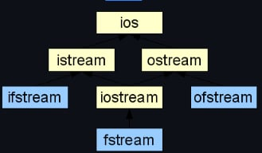

# 🖥️ Семинар 2: Подравняване на структури. Потоци и файлове. Текстови файлове. 🖥️ #

### Референции и указатели. Функции ###

- ако искаме да копираме променливата, а не да я променяме:
```cpp
void f(int a);
```

- ако искаме да променяме оригиналната променлива, която сме подали:

```cpp
void f(int& a); // предпочитаме, когато използваме единичен обект, 
				// защото ни гарантира, че обектът съществува

void f(int* a); // предпочитаме, когато работим с масиви (трябва да 
				// правим проверка за nullptr)
				// ако не променяме масива, използваме const int*
```
- ако искаме не просто да променим не просто паметта, към която сочи указателя, а да го пренасочим:

```cpp
void f(int*& a);
```
Пример:

```cpp
void f(int*& ptr, int n) { 
	ptr = new int[n];
}

int main() {
	int* ptr = nullptr;
    int n;
    std::cin>>n;
	f(ptr, n);  // ако не е подаден по референция, ще се направи 
                // копие на указателя, ще се задели нова памет, към 
                // която само копието ще сочи и в края на функцията  
                // f, копието ще  се изтрие от  стека, но не и 
                // паметта в heap-a, към която сочи
	delete[] ptr;
}
```

- функцията ни може да връща копие (интересуваме се само от стойността)
```cpp
int f(...);
``` 
- може да връща променлива
- трябва да си подсигурим, че променливата, което връщаме, ще живее след края на функцията, т.е. няма да е изтрита (да е подадана по референция във функцията или да е глобална променлива)

```cpp
int& f(...);
```

- може да връща указател
- отново трябва да подсигурим, че указателя ще съществува (подаден отвън или заделяме памет във функцията)

```cpp
int* f(...);
```

### Подравняване на структури ###

Паметта е байт-адресуема, тоест може да се достъпва всеки байт индивидуално.

Член-данните на една структура се разполагат в паметта в реда, в който са декларирани. Подравняването на една структура става по големината на най-голямата член данна.   

### Алгоритъм за намиране на големина на структура ###

1. Големината на структурата трябва да се дели на големината на най-голямата примитивна член-данна.
2. Всяка променлива трябва да е на адрес (започвайки от 0), който е кратен на големината й.

**Извод:** За постигане на минимален размер на структурата, трябва да подредим член-данните, така че големините им да са в нарастващ ред. (т.е. член-данните са сортирани в низходящ ред според големината им)

### Пример за 2 структури, които имат едни и същи член-данни, но различни рамери ###

```cpp
struct A{
    int x;        // 4 байта
    double y;     // първото число което се дели на 8 е 8, затова 
                  // double променливата ще "започне" на адрес 8  
    int z;        // първият свободен адрес е 16, 16 е кратно на 
                  // 4, следователно int променливата ще "започне"
                  // на адрес 16, 16 + 4 = 20, но 20 не се дели на 8
                  // първото число, което се дели на 8 е 24 
};

int main(){
    //Функцията sizeof() ще върне размера на структурата 
    sizeof(A); // = 24
}
```

```cpp
struct B{
    int x;      // 4 байта
    int z;      // 4 се дели на 4, 4 + 4 = 8, първият свободен е 8
    double y;   // 8 + 8 = 16
};

int main(){
    sizeof(A); // = 16
}
```
### Размер на празна структура ###

```cpp
struct E{};

int main(){
    sizeof(E) // = 1
}
```
- Защо размерът на празна структура е 1, а не 0? 
    - Стандартът на С++ не позволя обекти с нулев размер. Това е така, защото всяка инстанция на структура (или клас) трябва да има уникален адрес в паметта. Не бихме искали два обекта от една и съща структура(или клас) да се съхраняват на едно и също място в паметта.

### Пример за размер на структура, която има член-данни други структури ###

```cpp
struct D{
    double y;
    int x;
    int z;
};

struct J {
    E e;
    D d;        //sizeof(D) = 16;
    int a;
};

int main(){
    sizeof(J); // = 32
}
```
Вече знаем, че размерът на структурата Е е 1. Очакването ни би било структурата D да започне на адрес 16, но НЕ! Подравняването става по най-голямата ПРИМИТИВНА променливи (дори и при вложени структури). Тоест подравняването ще е по double-a от структурата D. И сега структурата D ще започне на адрес 8 (първият кратен на първата член-данна на D). 8 + 16 = 24. 24 е кратно на 4. 24 + 4 = 28, но 28 НЕ се дели на 8 следователно `sizeof(J) = 32`, а 32 е първото число кратно на 8. 

**Задача 1:** Разгледайте програмата `StructExamples.cpp` и пресметнете големината на структурите. 

### Потоци ###

- Какво е поток? 
    - Последователност от байтове, насочени в определена посока 
- При операциите за вход, байтовете идват от източник за вход(клавиатура, файл, друга програма и т.н.)
- При операциите за изход, байтовете данни "излизат" от програмата и се "вливат" във външно устройство(козола, файл и т.н.) 
- Потоците не предоставят произволен достъп до данните си, а само последователен, т.е можем да манипулираме данните само в реда, в който те пристигат от потока.
- Потоците служат като посредник между програмите и входно-изходните устройства.
- Потокът дефинира интерфейс с операции върху него, които не зависят от входно-изходните устройства. 
- За да извърши вход(входна операция) или изход(изходна операция), енда С++ програма: 
    - 1. създава поток
    - 2. свързва потока с входно-изходно устройство
    - 3. извършва операции за вход/изход върху потока
    - 4. прекъсва връзката с потока
    - 5. освобождава(затваря) потока
### Йерархия на потоците. Видове потоци ###


Познат за нас поток за вход е `std::cin`, а поток за изход е `std::cout`

### Работа с текстови файлове ###

- файл - последователност от байтове
- можем да отворим поток за вход/изход към файл

### Четене от файл ###

Четене символ по символ:
```cpp
#include<iostream>
//Тази библиотека ни позволява да отваряме потоци за четене/писане от файл
#include<fstream>

void readFromFile(const char* fileName){
   std::ifstream file;
   file.open(fileName);

   // Задължително проверяваме дали файлът се е отворил
    if(!file.is_open()){
        return;
    }

    //Четем символ по символ
    char ch;
    while(true){
        //вариант 1
        file.get(ch);
        //вариант 2
        // ch = file.get()

        //eof() ни казва дали сме в края на файла
        if(ch == file.eof()){
            break;
        }
        std::cout << ch << std::endl;
    }

    file.close();
}

int main(){
    readFromFile("myFile.txt");
}
```
**get указател - указател на istream/ifstream, реферира следващия елемент, който ще се прочете от потока**

Функцията `get()` без аргумент ни връща цяло число, а с агрумент записва в ch поредния символ, който трябва да се прочете от потока.Функцията get() е **неформатирана** (т.е чете интервали, символи за край на ред и др.)

Линк към документация на [get()](https://en.cppreference.com/w/cpp/io/basic_istream/get)

Затваряме файлов поток за четене с функцията `close()`

Четене дума по дума:
```cpp
#include<iostream>
#include<fstream>

void readFromFile(const char* fileName){
   std::ifstream file;
   file.open(fileName);

   // Задължително проверяваме дали файлът се е отворил
    if(!file.is_open()){
        return;
    }

    //Четем файла дума по дума
    char tempWord[100];
    while(!file.eof()){
        file >> tempWord;
        std::cout << tempWord << std::endl;
    }

    file.close();
}

int main(){
    readFromFile("myFile.txt");
}
```

Операторът ">>" е **форматиран**, тоест чете с разделител "интервал", както при `std::cout`.

Четене ред по ред:
```cpp
#include<iostream>
#include<fstream>

void readFromFile(const char* fileName){
   std::ifstream file;
   file.open(fileName);

   // Задължително проверяваме дали файлът се е отворил
    if(!file.is_open()){
        return;
    }

    //Четем файла ред по ред
    char tempLine[1024];
    while(!file.eof()){
        file.getline(tempLine, 1024);
        std::cout << tempLine << std::endl;
    }

    file.close();
}

int main(){
    readFromFile("myFile2.txt");
}
```

### Писане във файл ###

**put указател - указател на ostream/ofstream, реферира мястото в паметта, където ще се запише следващият елемент**

Линк към документацията на [put()](https://en.cppreference.com/w/cpp/io/basic_ostream/put)

```cpp
#include <iostream>
#include <fstream> 
int main () {
    // tempInfo.txt се създава, ако не е съществувал до сега
    std::ofstream tempFile("tempInfo.txt"); 

    if (!tempFile.is_open()){
        std::cout << "Problem while opening the file" << std::endl;
        return 1;
    }

    // Пишем текст
    tempFile << "New info\n"; 
    // Пишем числа
    tempFile << 5 + 7 << "\n"; 

    tempFile.close(); 
}
```

### Подаване на поток като аргумент на функция ###

```cpp
void(std::ifstream& file){
    //Do something
} 
```

ВИНАГИ ПОДАВАМЕ ПОТОЦИ ПО **РЕФЕРЕНЦИЯ** КАТО АРГУМЕНТ НА ФУНКЦИИ.

**Задача 2:** Напишете програма, която отпечатва кода си.