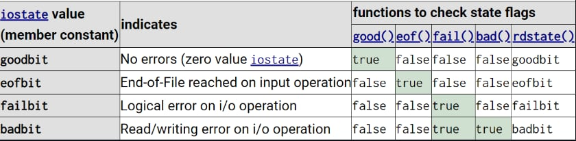
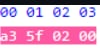

# 🖥️ Семинар 3: Обединения. Текстови и двоични файлове. 🖥️

## Обенинения (unions)
Последователност от променливи, които споделят една памет. Променливите могат да бъдат от различни типове. Във всеки един момент обаче може да се използва само една променлива от състава на обединението. 

```cpp
union A{
    int n; 
    char ch;
};
```
`sizeof(A)` ще върне размерът на най-големямата (по памет) член-данна. Ако променим стойността на int-a, то ще променим и стойнпстта на char-a. 

Линк към [лекцията](https://www.youtube.com/watch?v=crqIYpnXUc4&list=PLFMv1QLrQNiRoqRDVPKiwE1fAlntSCer2&index=14) на доцент Семерджиев.

## Пример с IP адреси

- Какво е IP адрес? 
    - IP адресът е уникален адрес, много наподобяващ телефонен номер, който се използва от машини (обикновено компютри), за да се свързват едни с други, когато изпращат информация през интернет или локална мрежа, използвайки интернет протокол (IP). Пример за IP адрес е 192.233.005.111. Повече детайли в курса по мрежи🛜
    - Това, което ще ни интересува е "математическото представяне" на IP адрес, а именно това е в някакъв смисъл "наредена" четворка от числа в интервала от [0;255], с това свойство, че нарденената четворка може да се преобразува до 32-битово число. Как става това? Разделяме 32-битовото число на 4 части с по 8 бита. Така първият октет от битове "кодира" първото число, вторият октет "кодира" второто число и т.н. 

        Пример:   

        ```
        IP address = 004.064.192.200 
        200 = 011001000
        192 = 011000000
        064 = 001000000
        004 = 000000100
        ```

        Така полученото 32-битово число е `  000000100011000000001000000000000100` Можете да си го сметнете и сами😁

Можем да представим IP адрес чрез `union`

```cpp
#include <iostream>
#include <fstream>

union IpAddress {
	uint32_t address;
	uint8_t octets[4];
};

int main() {
	IpAddress myAddress;
	myAddress.address = 16777343;
	
	std::cout << (int)myAddress.octets[0] << "." 
	          << (int)myAddress.octets[1] << "." 
	          << (int)myAddress.octets[2] << "." 
	          << (int)myAddress.octets[3];
	
}
```

**Задача 1**  Напишете функция, която приема име на съществуващ файл и име и копира съдържанието на същестуващия файл в нов файл.

**Задача 2** Напишете функции, които запазват и четат масив от студенти в текстов файл. Студент ще представяме чрез имету му, възраст и специалност. Специалностите могат да бъдат "Софтуерно инженерство", "Компютърни науки", "Информационни системи" и "Информатика".

## Флагове на състоянията на потока

| Флаг     | Значение                                                         |
|----------|------------------------------------------------------------------|
| `bad()`  | Има загуба на информация. Някоя операция за четене и писане не е изпълнена. |
| `fail()` | Последната входно/изходна операция е невалидна.                  |
| `good()` | Всички операции са изпълнени успешно.                            |
| `clear()`| Изчиства състоянието на потока (Вече good() ще върне истина).     |
| `eof()`  | Достигнат е края на файла.                                       |




## Позициониране във файл
| Функция            | Описание                                                             |
|-------------------|----------------------------------------------------------------------|
| `tellg()`         | Връща позицията на текущия символ в потока за четене                |
| `tellp()`         | Връща позицията на текущия символ в потока за писане                |
| `seekg(offset, direction)` | Премества get-указателят на позиция в потока за четене, според `offset` и `direction` |
| `seekg(streampos idx)` | Премества get-указателят на позиция `idx` в потока за четене         |
| `seekp(offset, direction)` | Премества put-указателят на позиция в потока за писане, според `offset` и `direction` |
| `seekp(streampos idx)` | Премества put-указателят на позиция `idx` в потока за писане         |

- **offset** : целочислена стойност. Отместването от direction.

- **direction** : Може да заема следите стойностти:

    | Флаг      | Описание                                     |
    |-----------|----------------------------------------------|
    | `ios::beg` | Началото на файла.                           |
    | `ios::cur` | Текущата позиция във файла.                  |
    | `ios::end` | Края на файла.                               |

**Задача 3** Да се напише функция, която намира размера на файл.

## Режими на работа
Режимът на работа е цяло число. В двоичното представяне на числото всеки бит съответсва на някой от флаговете от таблицата. Ако искаме да комбинираме няколко флага използваме "двоично или" ('|'). Напомням, че "двоичното или" е всъщност операцията "+" за двоични числа. 

| Флаг           | Ефект                                                                     | Число |
|----------------|---------------------------------------------------------------------------|----------------|
| `ios::in`      | Отваря файл за извличане.                                                | 1             |
| `ios::out`     | Отваряне на файл за вмъкване. Допуска се вмъкване на произволни места във файла. Ако файлът съществува, съдържанието се изтрива. | 2 |
| `ios::ate`     | Отваря за вмъкване и установява указателя put в края на файла. Допуска вмъкване на произволни места. | 4 |
| `ios::app`     | Отваря за вмъкване и установява указателя put в края на файла.           | 8             |
| `ios::trunc`   | Ако файлът съществува, съдържанието се изтрива.                         | 16             |
| `ios::binary`  | Превключва режима от текстов в двоичен.                                  | 32             |

## Работа с fstream 

До сега отваряхме файлови потоци **само** за писане или **само** за четене. Съвсем естествено е да си зададем въпроса дали не може да отворим един файл, както за писане, така и за четене. Отговорът е ДА, но има някои особености, когато комбинираме четене и писане.

За да отворим файлов поток за четене И писане използваме `std::fstream`. В интерфейса на `std::fstream` има всички функции на `std::ifstream` и `std::ofstream`. Когато инициализираме обект от тип `std::fstream` е необходимо освен името на файла, да **въведем и режима на работа**.


```cpp
std::ofstream file1("file1.txt");                   // не е нужно да задаваме режим  на работа
std::fstream  file2("file2.txt", std::ios::out);   // задаваме режим на работа
```
Пример за комбиниране на флагове: 

```cpp
std::fstream  file2("file2.txt", std::ios::out | std::ios::nocreate); 
```

## Двоични файлове


За да отворим файл в двоичен формат, трябва да използваме режима на работа `ios::binary` 

За да пишем в двоичен файл или/и да четем от него, използваме функциите:

```cpp
read(char* memoryBlock, size_t size);
write(const char* memoryBlock, size_t size);
```

### ☠️Обърнете внимание, че функцията write() приема char*. Ако искаме да запазим променлива от друг вид, ще трябва експлицитно да преобразуваме указателя към char* (без значение, че указателят не сочи към елементите от тип char*)☠️

## Пример за писане в двоичен файл: 
 ```cpp
 #include <iostream>
#include <fstream>

int main()
{
   std::ofstream f("file.dat");

   int a = 155555;

   f.write((const char*)&a, sizeof(int));

   f.close();
}
 ```

## Пример за четене от двоичен файл: 

```cpp
#include <iostream>
#include <fstream>

int main()
{
  std::ifstream f("file.dat");

  int a;
  f.read((char*)&a, sizeof(int));

  std::cout << a << std::endl;

  f.close();
}
```
### Съдържанието на двоичния файл:


Байтовете се записват в **обратна посока**. Най-старшият байт е последен. Следователно запаметеното число е 00025fa3, което е точно шестнайсетичният запис на числото 155555.

**Задача 4:** В двоичен файл има масив от числа.Напишете функция, която прочита тези числа и ако
- числото е **четно**, го записва в двоичен файл с име `even.dat`
- числото е **нечетно**, го записва в двоичен файл с име `odd.dat`

**Задача 5:** Да се реализира програма за изглед и модификация на двоични файлове (**hex viewer**). При стартиране на програмата трябва да се въведе път до двоичен файл и да зареди съдържанието на файла в паметта. След като файлът се е заредил в паметта, трябва да поддържате следните операции:

- Преглед на файла (view) отпечатва байтовете на файла (в шестнайсетична бройна система). След това да се отпечатат интерпретацията на байтовете като символи. Ако байтът отговаря на малка/голяма латинска буква, то да се отпечата символа. В противен случай да се отпечатва точка.
- Промяна на байт по индекс (change ).
- Премахване на последния байт (remove)
- Добавяне на байт в края (add ).
- Запазване на промените в същия файл (save)
- Запазване на промените в друг файл (save as)

**Важно!!!** Не се ползволява използването на stl, както и std::hex.